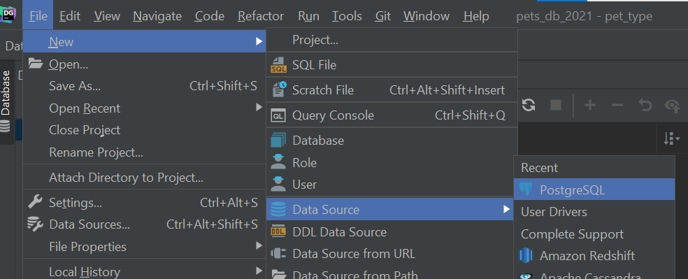
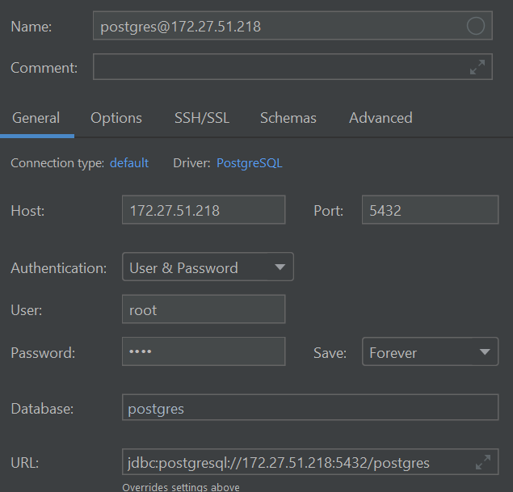
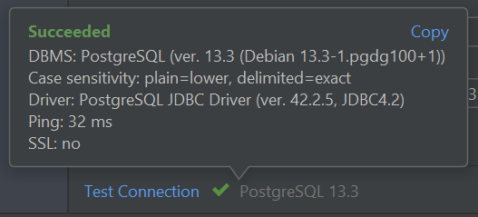
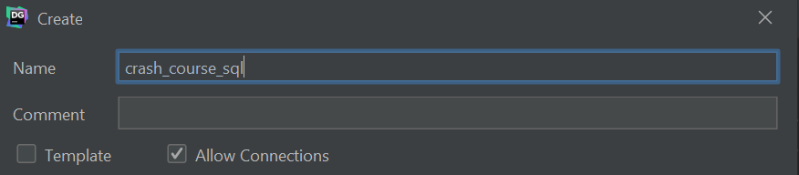
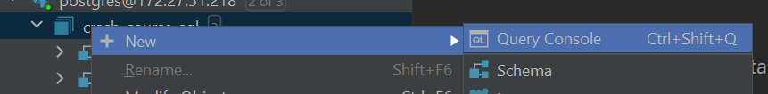
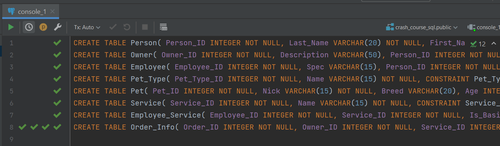

# SQL Crash Course

## Intro

Hi, here are the tasks that I was solving when I started to study SQL. Its cover the basic functionality of the  Structured Query Language. 

I did everything in PostgreSQL. Next there will be instructions for local installation.

### Prerequriments

-  Unix-like OS ([Ubuntu](https://ubuntu.com/))
- IDE for SQL (I use [DataGrip](https://www.jetbrains.com/datagrip/) but you can also in the terminal)
- [Docker](https://www.docker.com/)

## Preparation

Let's do a little preparation of the environment.

## PostgreSQL installation

The database will work in docker, this makes installation very easy. In order for the PostgreSQL to become available on port `5432` with credentials `root`:`root` and database name equal `db`, go to the directory with the [`docker-compose.yml`](docker-compose.yml) file and run the following command:

``` bash
docker-compose up -d
```

  ### PostgreSQL connection

To work with PostgreSQL, you need to connect to it. To do this, you need to do the following:

1. Select in the settings, connection to PostgreSQL.



2. Enter data into the form.



3. Check the connection.



### Database initialization

After all the programs are working correctly, you need to create a database.

1. Select in the settings, New Database.


2. Enter the name for the database.



3. Open its console.



4. Enter the [script](init.sql) that initialize the database.



## Tasks

### 1

#### 1. Get data about 'Molly'

```sql
SELECT *
FROM Pet
WHERE Nick='Molly'
```

#### 2. Nicks and breeds of all pets sorted by age

```sql
SELECT Nick, Breed
FROM Pet
ORDER BY Age ASC
```

#### 3. Get pets with description 

```sql
SELECT *
FROM Pet
WHERE Length(Description) > 0
```

#### 4. Get average age of poodles

```sql
SELECT AVG(Age)
FROM Pet
WHERE Breed = 'Poodle'
```

#### 5. Get number of owners

```sql
SELECT COUNT(DISTINCT Pet.Owner_id)
FROM Pet
```

### 2

#### 1.  Get data about 'Molly' with pet type

```sql
SELECT Pet.*, name
FROM Pet
JOIN Pet_Type ON Pet.Pet_Type_ID = Pet_Type.Pet_Type_ID
WHERE Nick='Molly'
```

#### 2. Get list of all dogs by name, breed and age

```sql
SELECT Nick, Breed, Age
FROM Pet
JOIN Pet_Type ON Pet.Pet_Type_ID = Pet_Type.Pet_Type_ID
WHERE Name = 'DOG'
```

#### 3. Get average cat's age

```sql
SELECT AVG(Age)
FROM Pet
JOIN Pet_Type ON Pet.Pet_Type_ID = Pet_Type.Pet_Type_ID
WHERE Name = 'CAT'
```

#### 4. Time and executors of not done orders

```sql
SELECT Time_Order, Last_Name
FROM Order_Info
JOIN Person ON Order_Info.Employee_ID = Person.Person_ID
WHERE is_done = 0
```

#### 5. List owners of dogs

```sql
SELECT First_Name, Last_Name, Phone
FROM Pet
JOIN Pet_Type ON Pet.Pet_Type_ID = Pet_Type.Pet_Type_ID
JOIN Owner ON Owner.Owner_ID = Pet.Owner_ID
JOIN Person ON Owner.Person_ID = Person.Person_ID
WHERE Name = 'DOG'
```

#### 6. All types of pets and the names of representatives of these breeds

```sql
SELECT Name, Nick
FROM Pet_Type
LEFT OUTER JOIN Pet ON Pet_Type.Pet_Type_ID = Pet.Pet_Type_ID
```

### 3

#### 1. How many pets are there at age 1 year, 2 year, etc.?

```sql
SELECT Age, COUNT(*)
FROM Pet
GROUP BY Age
```

#### 2. How many cats, dogs, etc. aged 1 year, 2 year, etc. ?

```sql
SELECT Age, Name, COUNT(*)
FROM Pet
JOIN Pet_Type ON Pet.Pet_Type_ID = Pet_Type.Pet_Type_ID
GROUP BY Age, Name
ORDER BY Age ASC
```

#### 3. Pet breeds with an average age of less then 6 years

```sql
SELECT AVG(Age), name
FROM Pet
JOIN Pet_Type ON Pet.Pet_Type_ID = Pet_Type.Pet_Type_ID
GROUP BY Name
HAVING AVG(Age) < 6
```

#### 4. Last names of employees who completed more than five orders

```sql
SELECT Last_Name, COUNT(*)
FROM Order_Info
JOIN Person ON Order_Info.Employee_ID = Person.Person_ID
WHERE Order_Info.is_done = 1
GROUP BY Person.Person_ID
HAVING COUNT(Order_Info.Order_ID) > 5
```

### 4

#### 1. Get all grades for completed orders, the executors of which were students

```sql
SELECT Mark
FROM Order_Info
WHERE Is_Done = 1
AND Employee_ID IN (
                   SELECT Employee_ID
                   FROM Employee
                   WHERE Spec = 'student'
                   )
```

#### 2. Last names of workers who have not received a single order yet

 ```sql
 SELECT Last_Name
 FROM Employee
 JOIN Person on Person.Person_ID = Employee.Person_ID
 WHERE Employee.Person_ID NOT IN (
                                 SELECT Employee_ID
                                 FROM Order_Info
                                 )
 ```

#### 3. List of orders (type of service, time, Last name of the worker, pet's nick, Last name of the owner)

```sql
SELECT Name, Time_Order, Employee.Last_Name, Nick, Owner.Last_Name
FROM Order_Info
JOIN Person as Employee ON Employee.Person_ID = Order_Info.Employee_ID
JOIN Person as Owner ON Owner.Person_ID = Order_Info.Owner_ID
JOIN Pet ON Pet.Pet_ID = Order_Info.Pet_ID
JOIN Service ON Service.Service_ID = Order_Info.service_id
```

#### 4. Get general list of comments available in the database

```sql
SELECT Comments FROM (
                                SELECT Comments
                                FROM Order_Info
                                UNION
                                SELECT Description
                                FROM Owner
                                UNION
                                SELECT Description
                                FROM Pet
                              ) AS Comments
WHERE LENGTH(Comments) > 0
```

#### 5. Get first name and last name of workers, who get mark equal 5

```sql
SELECT First_Name, Last_Name
From Person
WHERE Exists(
            SELECT 1
            FROM Order_Info
            WHERE Mark = 5 AND Person.Person_ID = Order_Info.Employee_ID
            )
```

### 5

#### 1. Write a statement adding a new individual to the PERSON table while preserving the sequential numbering of records.

```sql
INSERT INTO Person (Person_ID, Last_Name, First_Name,
Phone, Address) VALUES ((
        SELECT MAX(Person_ID) + 1
        FROM Person
        ),
        'Lee', 'Robert', '972-701-5939', '1782 Charla Lane, Dallas, TX 75240 ')
```

#### 2. Write a statement that adds an “(s)” to the beginning of the comment for each order that is a student

```sql
UPDATE Order_Info
SET Comments = CONCAT('(s)', COALESCE(comments, ''))
FROM Employee
WHERE Employee.Employee_ID = Order_Info.Employee_ID and Spec = 'student'
```

#### 3. Create a new table in the database for storing data on documents of individuals (type and number of document). When creating a link from it to the PERSON table, specify the delete cascade property

````sql
CREATE TABLE Documents(
 Document_ID INTEGER NOT NULL,
 Name VARCHAR(50),
 Number INTEGER,
 Person_ID INTEGER NOT NULL,
 CONSTRAINT Document_PK PRIMARY KEY (Document_ID)
);
ALTER TABLE Documents ADD CONSTRAINT FK_Docs_Person
FOREIGN KEY (Person_ID)
REFERENCES Person(Person_ID) ON DELETE CASCADE;
````

### 6

#### 1. Create a Dogs view with the following attributes: name, breed, age, last name, and first name of the owner

```sql
CREATE VIEW Dogs
AS SELECT Nick, Breed, Age, Last_Name, First_Name
FROM Pet
JOIN Pet_Type ON Pet.Pet_Type_ID = Pet_Type.Pet_Type_ID
JOIN Person ON Pet.Owner_ID = Person.Person_ID
WHERE Name = 'DOG'
```

#### 2. Create the Employee Rating view: last name, first name, number of completed orders, average score (by rating)

```sql
CREATE VIEW Rate
AS SELECT Last_Name, First_Name, COUNT(Order_ID), AVG(Mark)
FROM Order_Info
JOIN Person ON Order_Info.Employee_ID = Person.Person_ID
WHERE Is_Done = 1
GROUP BY Employee_ID, Last_Name, First_Name
```

#### 3. Create the Customers view: last name, first name, phone number, address

```sql
CREATE VIEW Customers
AS SELECT Last_Name, First_Name, Phone, Address
FROM Person
WHERE Person_ID NOT IN (
                        SELECT Employee_ID
                        FROM Employee_Service
                        )
```


